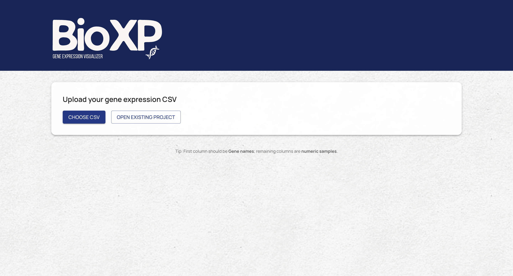
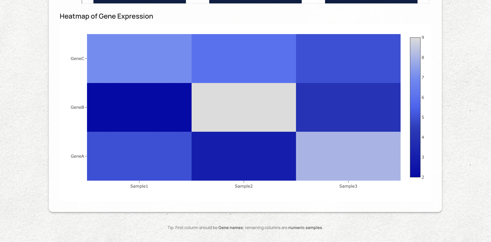

# BioXP — Gene Expression Visualizer

BioXP is a fullstack web application for uploading, visualizing, and saving gene expression datasets.  
It allows users to explore biological CSV data through interactive tables, bar charts, and heatmaps, with projects saved for later access.

This project was built to practice full stack development, data visualization, and database integration.

## Screenshots

### Upload and Explore Datasets


### Gene Expression Bar Chart


### Heatmap Visualization


## Features

- Upload gene expression CSV files
- Automatic parsing and validation of input data
- Interactive bar charts and heatmaps
- Tabular view of gene expression values
- Save datasets and reload them later
- Clean, modern UI built with Material UI 
- Custom branding created on Canva

## Tech Stack

### Frontend
- React
- Material UI (MUI)
- Recharts
- Plotly.js
- PapaParse

### Backend
- Node.js
- Express
- Multer (file uploads)
- PapaParse (CSV parsing)

### Database & Storage
- Supabase (PostgreSQL + file storage)


## Expected CSV Format

The uploaded CSV file should follow this structure:

- **First column:** `Gene` (gene identifiers)
- **Remaining columns:** numeric sample values

Example:

```csv
Gene,Sample1,Sample2
TP53,12.4,9.1
BRCA1,5.2,7.8
EGFR,3.1,4.6
